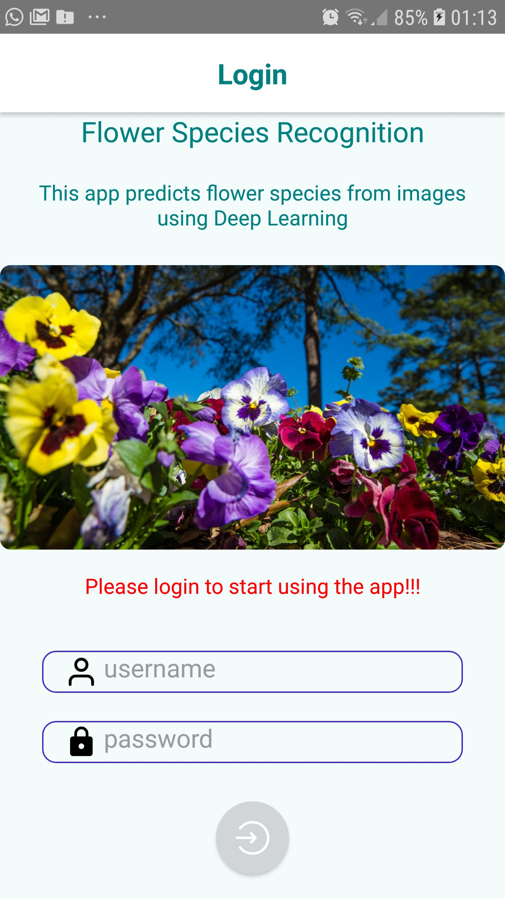
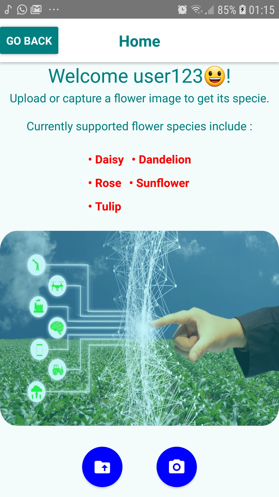
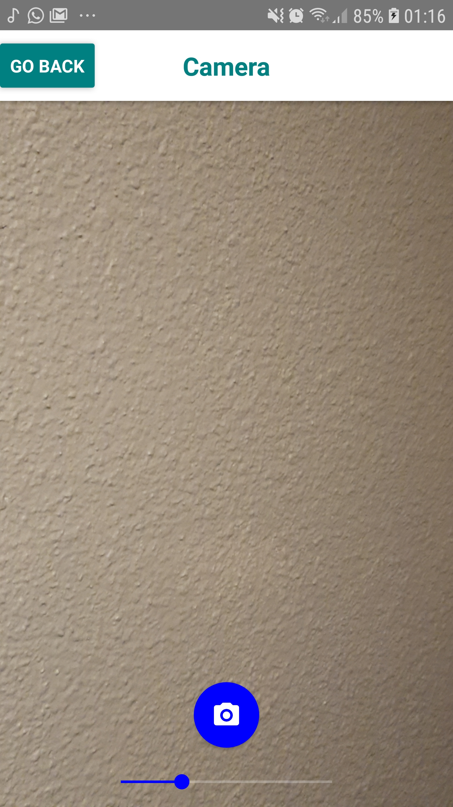
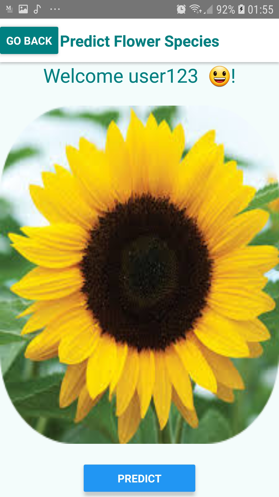
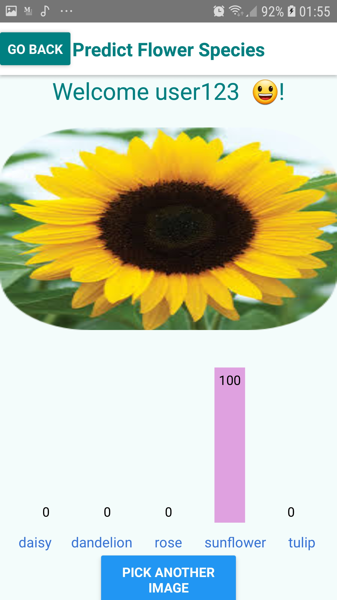

<h1 style="color:'white'; text-align:center;"> whichFlower : a flower species recognition app using tensorflow/keras and React-Native </h1>
  

  

  As a passionate person about computer vision (CV), I came to know that model deployment is also important in model development process because the usefulness of a model is measured by the satisfaction of end users. In a previous project I named DEmoClassi (Demographic (age, gender race) and Emotion (happy, neutral, angry, ...) Classification) I tried to turned my trained models in a standalone python module that can be run on windows/Linux using OpenCV. <a href="https://github.com/AlkaSaliss/DEmoClassi">You can check it here</a>.

 

In this new project I decided to give mobile technologies a try. Today the models are migrating more and more to the edge devices (mobile, sensors, ... IOT in general). So I started by learning React-Native, a cross-platform mobile development framework developed by Facebook. The course <a href="https://www.youtube.com/playlist?list=PLhQjrBD2T382gdfveyad09Ierl_3Jh_wR">is available on youtube</a>, it is a little bit long, but it worth learning it.
The end goal for me was to combine my 2 passions, CV and programming into another project : this time I opted for CV model training and deployment on mobile device of a flower species recognition app I called, with no suspens,  `WhichFlower`.

 

I'll try to describe my journey using this post composed of three sections : 

<ul style="color:white; text-align:justify;">
<li style="color:white; text-align:justify;"> Exploratory Data Analysis in which I analyse the flower images dataset I'll use </li>
<li style="color:white; text-align:justify;"> Image classification models training </li>
<li style="color:white; text-align:justify;"> Model deployment using React-Native </li>
</ul>

 




<h2 style="color:white;">App structure</h2>

The application content walkthrough is beyond the scope of this post. Nevertheless, I'll give an overview of the app in this last section.  
  The model is deployed using a library called "tflite-react-native" (<a href="https://github.com/shaqian/tflite-react-native">see this github page for more details</a>. The workflow consists of first converting the trained keras models into <a href="https://www.tensorflow.org/lite/convert/python_api#converting_a_keras_model_">tensorflow lite format</a> and use the tflite-react-native library to integrate the tf-lite model into the react-native application. 
The application consists mainly of 4 screens for which the code is located in the `screens` folder in the repository. The screens are as follow :  
  <ul style="color:white; text-align:justify;">
  <li style="color:white; text-align:justify;"> login screen (`login-screen.js` file) which is the entry point of the app. It contains a simple login form (user name and password). However there is no real control of the user name and passwod being typed as the app is not connected to any server. The eonly control I implemented is the number of character being typed. So it is just a kind of dummy login screen </li>  
      
  
  <li style="color:white; text-align:justify;"> Once the user is logged in, he is redirected ot the home screen (`home.js` file) where the user has the possibility to take the picture of a flower using the phone's camera, or upload a flower image directly from his phone's storage </li>  
      
  
  <li style="color:white; text-align:justify;"> The camera screen (`camera-screen.js` file) allows the user to capture an image (hopefully a flower one :) ) using the phone's camera </li>  
     
   
  <li style="color:white; text-align:justify;"> The image being uploaded/captured, the user passes to the final screen whic allows the user to predict the specie of the corresponding flower image. And that is the predict screen (`predict-screen.js` file) </li>  
  
    
  
  <li style="color:white; text-align:justify;"> There is another file (barChart.js) which contains the implementation code for the bar chart (representing the probability predcited  for each flower class) displayed in the predict screen </li>
  </ul>

